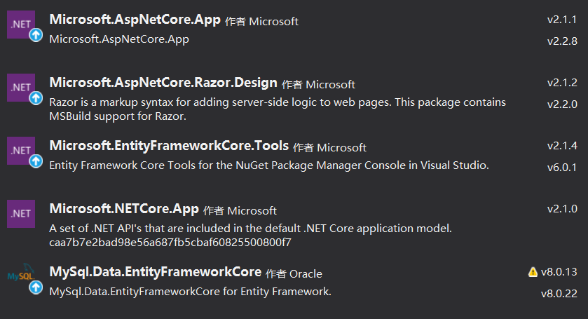

# XMUer
厦门大学软件工程专业19级 21-22 dotnet课程设计大作业

### 2021-12-18 02:05:53

本项目基于https://github.com/lhanlhanlhan/xmuer 开发，在该项目基础上添加或修改以下功能：

1. 用户注册之后，将用户密码加密为16位MD5码进行存储，之后涉及密码的操作只能经过加密后与数据库中结果进行对比，无法直接拿到原有密码
2. 未登录状态下，在主页面右上角添加登录和注册按钮
3. 将Session会话过期时间设置为5分钟，方便调试与使用。若需要修改，可以修改Startup.cs文件的services.AddSession中的内容
4. 将所有使用到的对象移动到Models目录下，原先是一部分放在Entities目录，一部分放在Models目录下，容易混淆
5. 修正部分类命名空间的问题
6. 为用户信息页面UserInfo.cshtml添加学号、学院、专业、院系等信息的修改
7. 修正用户信息UserInfo中性别信息的bug，未修改前，如果不选择性别，会导致错误将默认选项作为字符串写入数据库，后续在Convert.ToInt32时会报错
8. 修改用户信息中生日的显示和修改逻辑，采用ShortDateString的格式进行显示，在代码中使用Convert.ToDateTime和DateTime.ToShortDateString进行日期格式的转换
9. 为用户主页页面UserHome.cshtml添加头像、个人简介等信息的修改，用户可以在预设头像中选择头像，不选择或未选择则使用默认头像
10. 为相册页面添加相册封面、相册名等信息的修改，用户可以在预设封面中选择封面，不选择或未选择则使用默认封面
11. 添加相册删除功能
12. 相册不再使用相册内图片作为封面
13. 添加相册内照片删除功能，删除照片将同时删除数据库中photo表的对应记录以及对应照片文件（图片文件统一存放在/wwwroot/album下）
14. 用户现在可以在StatusList页面（即状态分享页面），通过点击点赞按钮之后的对话气泡图标查看该状态详情
15. 所有公开信息的页面，如主页的新鲜事页面、查找好友页面、状态详情页面，展示的用户信息从“用户名+头像”改为“真实姓名+头像”。因为用户名为登录必需信息，将登录信息公开可能存在安全问题

另外，未实现或仍有问题的功能如下：

1. 登录注册失败后没有设置对应的提示信息，只是简单的return Content。可以考虑使用ajax作出alert的提示
2. 用户头像和相册封面可以考虑使用文件上传的方式进行修改
3. 在不考虑性能的情况下，可以为用户表的部分字段添加UNIQUE索引，防止重复注册和重复的用户信息
4. 相册页面前端代码中，JavaScript和jQuery混用，可以考虑进行整合
5. 可以考虑留言功能（指用户主页的留言）
6. 用户登录页面的“记住我”和“忘记密码”是摆设，没有用，可以考虑进一步实现。“记住我”功能可以使用Cookie，“忘记密码”可以让用户发起重置密码请求，管理员批准后将用户密码重置为123456
7. 所有页面使用cshtml编写，可以考虑替换为aspx，拥有更多更方便的控件，前后端交互也更加方便
8. 数据库使用MySQL，但visual studio的mysql连接包几年前就不再更新。可以考虑将换为SQL Server，这样可以在Visual Studio中直接对数据库进行操作，更加方便

### 2021-12-18 02:10:33

项目使用的Nut包和对应版本如下：

项目采用Visual Studio 2019进行编写，使用框架为.NET Core 2.1

使用前，记得更改appsettings.json文件中的DefaultConnection字符串

### 2021-12-18 13:30:30

修复了新鲜事页面会显示还在草稿箱里的Share的bug
